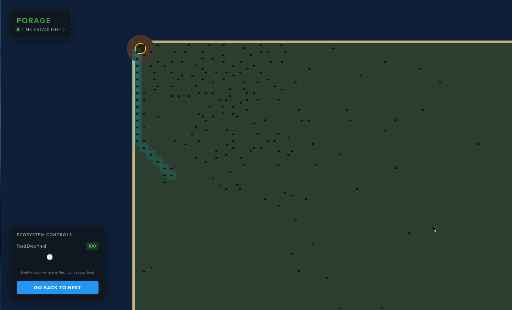
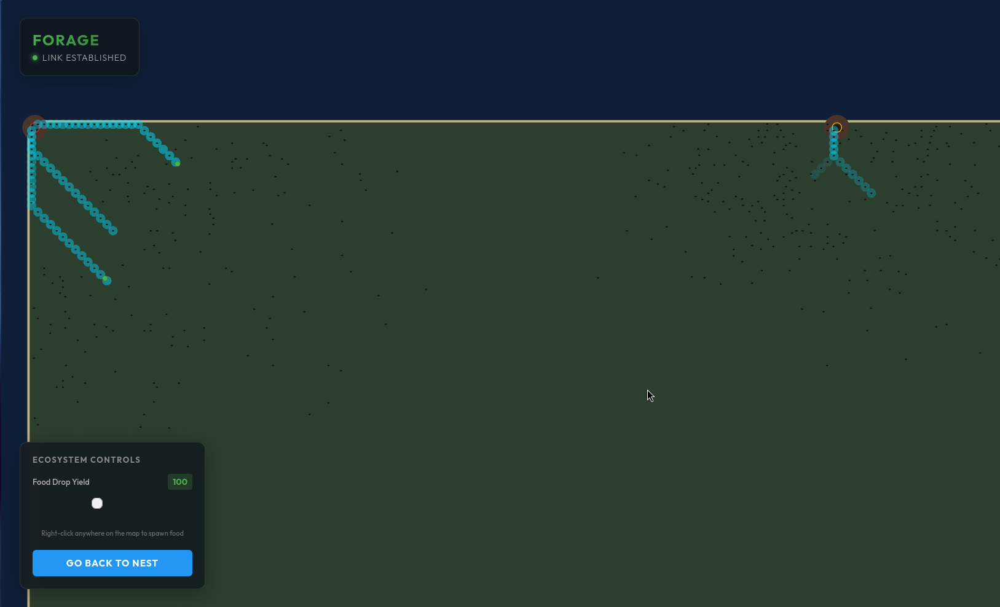

``` markdown
                               ___________                             
                               \_   _____/_______________     ____   ____ 
                                |    __)/  _ \_  __ \__  \   / ___\_/ __ \ 
                                |     \(  <_> )  | \// __ \_/ /_/  >  ___/ 
                                \___  / \____/|__|  (____  /\___  / \___  >
                                    \/                   \//_____/      \/ 
```

A high-throughput, lock-free MMO engine built with Rust, WebAssembly, and HTML5 Canvas.

**Forage** is a web-based ecosystem simulation using Ant Colony Optimization algorithm, that scales to millions of active entities. It leverages an authoritative Rust backend, binary WebSocket streaming, and a zero-copy WebAssembly frontend to render vast, dynamic territories at a stable 60 FPS. 

## Screenshots

|                  World View                  |                Multiplayer              |
| :--------------------------------------------: | :--------------------------------------: |
|  |  | 

## Core Architecture & Features

* **Bitwise-Oriented Spatial Hashing:** The physical world matrix (maps, territories, and chunks) is strictly engineered around powers of two (e.g., 32x32 tiles per chunk). This replaces expensive CPU division and modulo instructions with instantaneous bitwise shifts allowing branchless executions.
* **SIMD-Optimized Data Structures:** By favoring Data-Oriented Design (DOD) and flat, contiguous memory buffers, the engine memory layout is primed for CPU auto-vectorization, allowing hardware SIMD instructions to process massive entity updates in parallel.
* **Actor Model Concurrency:** The backend entirely bypasses `Mutex` and `RwLock` thread contention by utilizing a strict message-passing architecture. Each system component operates in a lock-free, disjointed environment, ensuring deterministic and stable tick latencies under extreme load.
* **Binary Stream Serialization:** Network communication relies entirely on raw binary payload serialization rather than bloated strings or JSON. This guarantees perfectly predictable network bandwidth, zero parsing overhead, and minimal L1 cache thrashing during high-frequency packet processing.
* **Zero-Copy WebAssembly Bridge:** The JavaScript rendering loop accesses the Rust WASM memory heap directly, completely eliminating data serialization across the JS/WASM boundary.
* **Client-Side Linear Interpolation (Lerp):** Decouples the 10-Tick-Per-Second server state from the 60 FPS hardware renderer, creating perfectly smooth entity movement between network frames.

## Current Limitations

Since this is the MVP engine build, a few design trade-offs are present:

* **Entity Identity Swapping:** Because ant positions are sent as pure bitboards (booleans) rather than tracked UUIDs to save bandwidth, the frontend's nearest-neighbor interpolation algorithm can occasionally cross paths and "swap" ant identities in highly dense crowds.
* **Ephemeral State:** There is no persistent database integration (e.g., PostgreSQL/DuckDB) yet. The entire world state lives in the server's RAM and resets on server restart.
* **Viewport Cap:** There is no cap on viewport size yet on the server side, anyone can zoom out get the whole map into the viewport and choke the bandwidth.

## How to Install and Run

Make sure you have [Rust, Cargo](https://rustup.rs/), and [wasm-pack](https://github.com/wasm-bindgen/wasm-pack) installed on your system.

1. Clone the repository:
```bash
git clone https://github.com/rlpratyoosh/forage.git
cd forage/

```

2. Compile the WebAssembly Client:

```bash
cd client
wasm-pack build --target web
cd ..

```

3. Start the Authoritative Server:

```bash
cd server
cargo run --release

```

*Note: The server handles both the WebSocket broker on `/join` and serves the static frontend via Axum. Once running, open `http://localhost:8080` in your browser.*

4. Run the Network Benchmark:

```bash
cargo run --release --bin server-bench

```

*Note: The benchmark utilizes `tokio` and `tokio-tungstenite` to stress-test the concurrent chunk subscription and WORM broadcast architecture.*

6. Run the Engine Benchmark:

```bash
cargo run --release --bin engine-bench

```

## Contributing

This is a personal portfolio project built for my own learning and growth in low-level systems engineering and distributed architecture. As such, **I am not accepting pull requests or external contributions at this time.** However, you are more than welcome to fork the repository, read the code, and experiment with it on your own!
